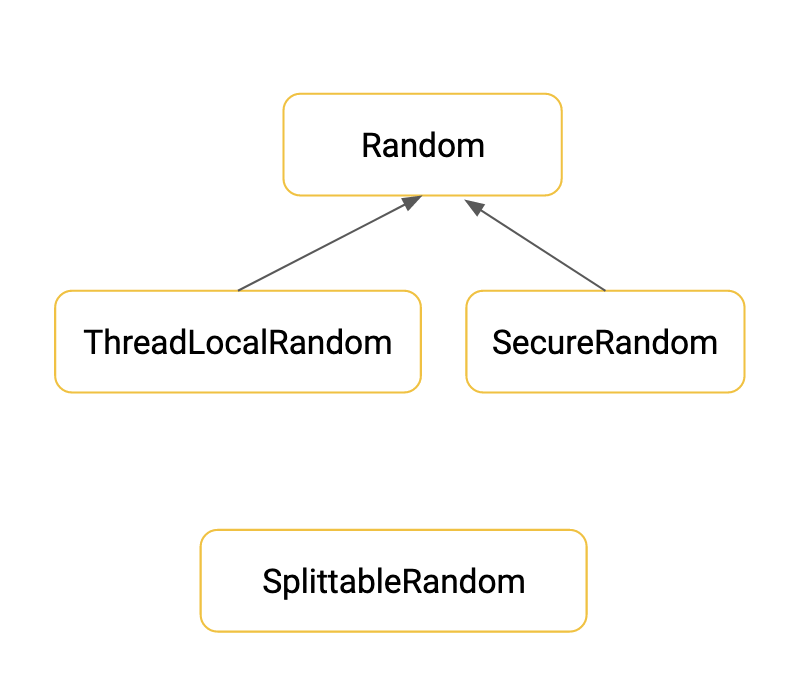

# JDK17 Features

## 1. Prepare

Install Java 17 use `sdk`

```bash
sdk install java 17.ea.33-open
sdk use java 17.ea.33-open
```

Link to JDK17 features: https://openjdk.java.net/projects/jdk/17/

---

## 2. JEPs:

<ul>
    <li><h3><input type="checkbox"> JEP 306: Restore Always-Strict Floating-Point Semantics</h3></li>
    <li><h3><input type="checkbox"> JEP 356: Enhanced Pseudo-Random Number Generators</h3>
<details>
  <summary>Details</summary>
  <div style="width: 50%" markdown="1">


  </div>


</details>
</li>
    <li><h3><input type="checkbox"> JEP 382: New macOS Rendering Pipeline</h3></li>
    <li><h3><input type="checkbox"> JEP 391: macOS/AArch64 Port</h3></li>
    <li><h3><input type="checkbox"> JEP 398: Deprecate the Applet API for Removal</h3>
<details>
  <summary>Details</summary>

Deprecate, for removal, these classes and interfaces of the standard Java API:
```
  - java.applet.Applet
  - java.applet.AppletStub
  - java.applet.AppletContext
  - java.applet.AudioClip
  - javax.swing.JApplet
  - java.beans.AppletInitializer
```
</details>
</li>
    <li><h3><input type="checkbox"> JEP 403: Strongly Encapsulate JDK Internals</h3>
<details>
  <summary>Details</summary>

A list of the packages affected is available here: https://cr.openjdk.java.net/~mr/jigsaw/jdk8-packages-strongly-encapsulated

Some exported com.sun APIs:

- The Compiler Tree API in the ``jdk.compiler`` module,
- The HTTP Server API in the ``jdk.httpserver`` module,
- The SCTP API in the ``jdk.sctp`` module, and
- JDK-specific extensions to the NIO API in the ``com.sun.nio.file`` package of the ``jdk.unsupported`` module.

</details>
</li>
    <li><h3><input type="checkbox"> JEP 406: Pattern Matching for switch (Preview)</h3></li>
    <li><h3><input type="checkbox"> JEP 407: Remove RMI Activation</h3>

<details>
  <summary>Details</summary>

- Remove the java.rmi.activation package from the Java SE API specification 
- Update the RMI Specification to remove mentions of RMI Activation 
- Remove the JDK library code that implements the RMI Activation mechanism 
- Remove the JDK regression tests for the RMI Activation mechanism 
- Remove the JDK's rmid activation daemon and its documenation

</details>
</li>
    <li><h3><input type="checkbox"> JEP 409: Sealed Classes</h3>
</li>
    <li><h3><input type="checkbox"> JEP 410: Remove the Experimental AOT and JIT Compiler</h3>
<details>
  <summary>Details</summary>

Remove three JDK modules:

- `jdk.aot` (the jaotc tool) 
- `jdk.internal.vm.compiler` (the Graal compiler)
- `jdk.internal.vm.compiler.management` (Graal's MBean)

</details>
</li>
    <li><h3><input type="checkbox"> JEP 411: Deprecate the Security Manager for Removal</h3></li>
    <li><h3><input type="checkbox"> JEP 412: Foreign Function & Memory API (Incubator)</h3>
<details>
  <summary>Details</summary>

The Foreign Function & Memory API (FFM API) defines classes and interfaces so that client code in libraries and applications can:

- Allocate foreign memory (`MemorySegment`, `MemoryAddress`, and `SegmentAllocator`)
- Manipulate and access structured foreign memory (`MemoryLayout`, `MemoryHandles`, and `MemoryAccess`)
- Manage the lifecycle of foreign resources (`ResourceScope`)
- Call foreign functions (`SymbolLookup` and `CLinker`).

</details>
</li>
    <li><h3><input type="checkbox"> JEP 414: Vector API (Second Incubator)</h3></li>
    <li><h3><input type="checkbox"> JEP 415: Context-Specific Deserialization Filters</h3></li>
</ul>


---

## 3. Changes in JDK API beyond the JEPs 
